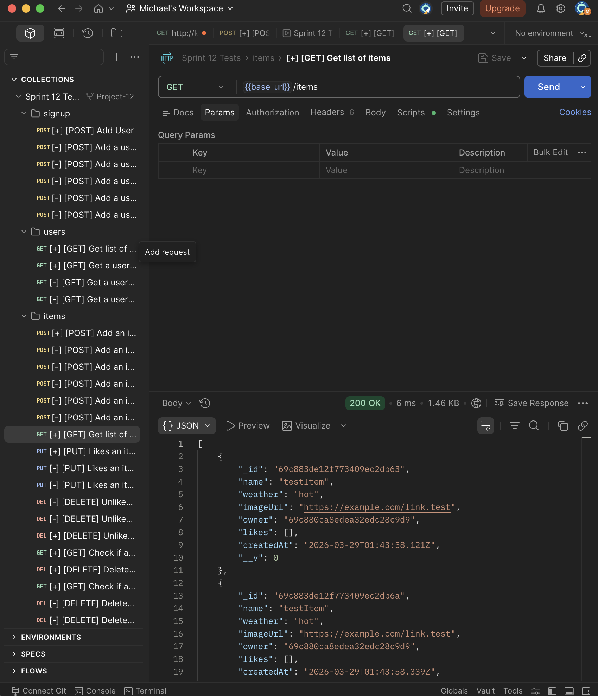
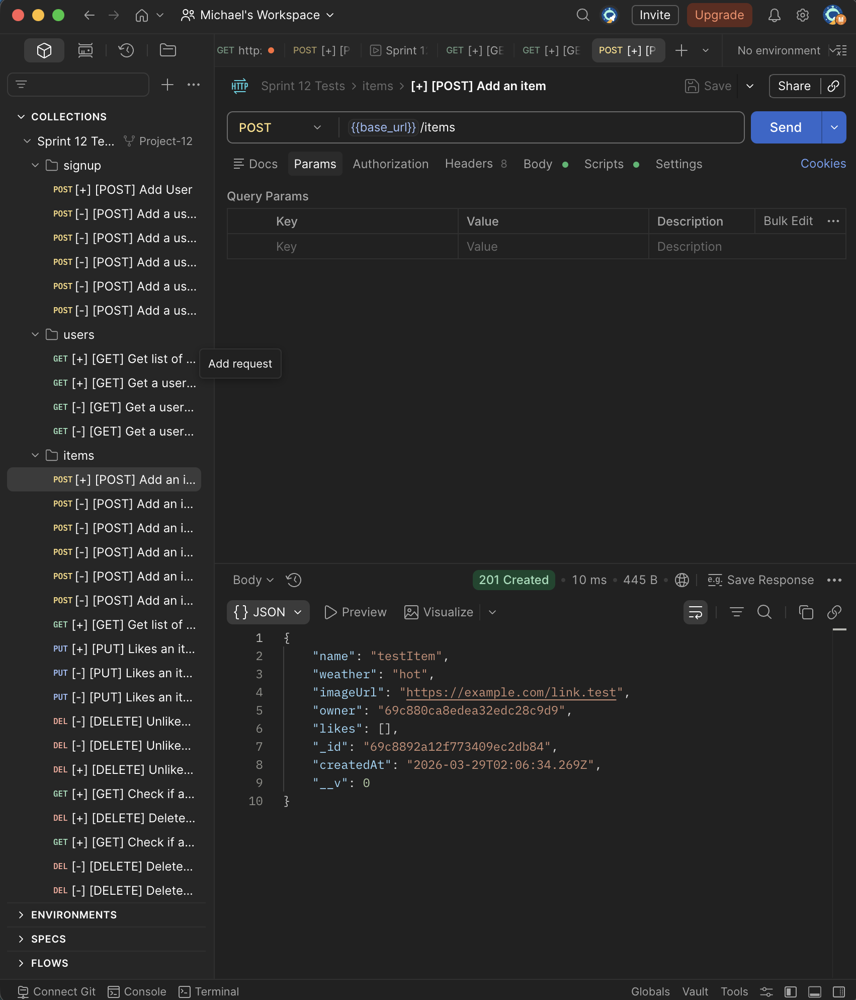
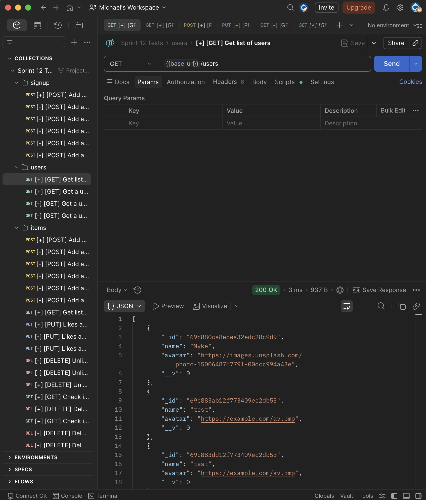
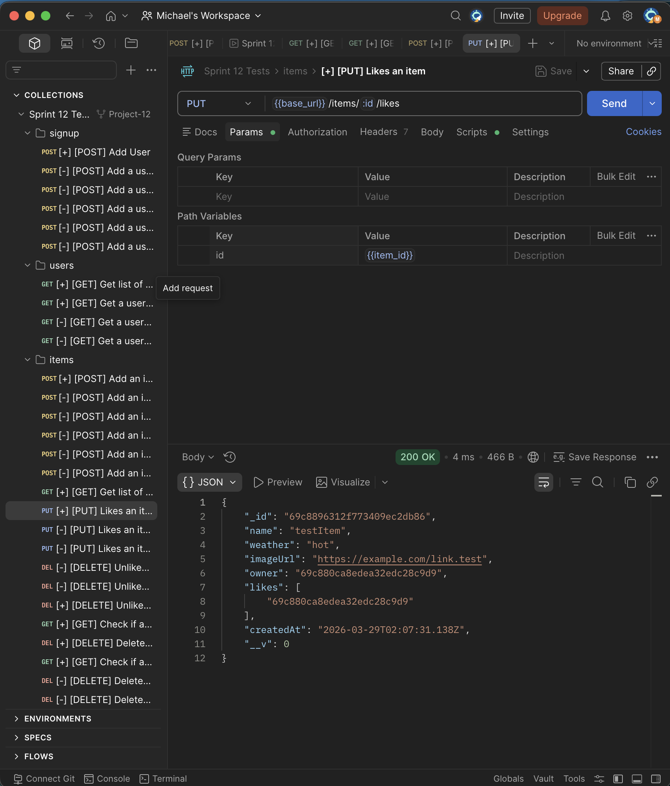
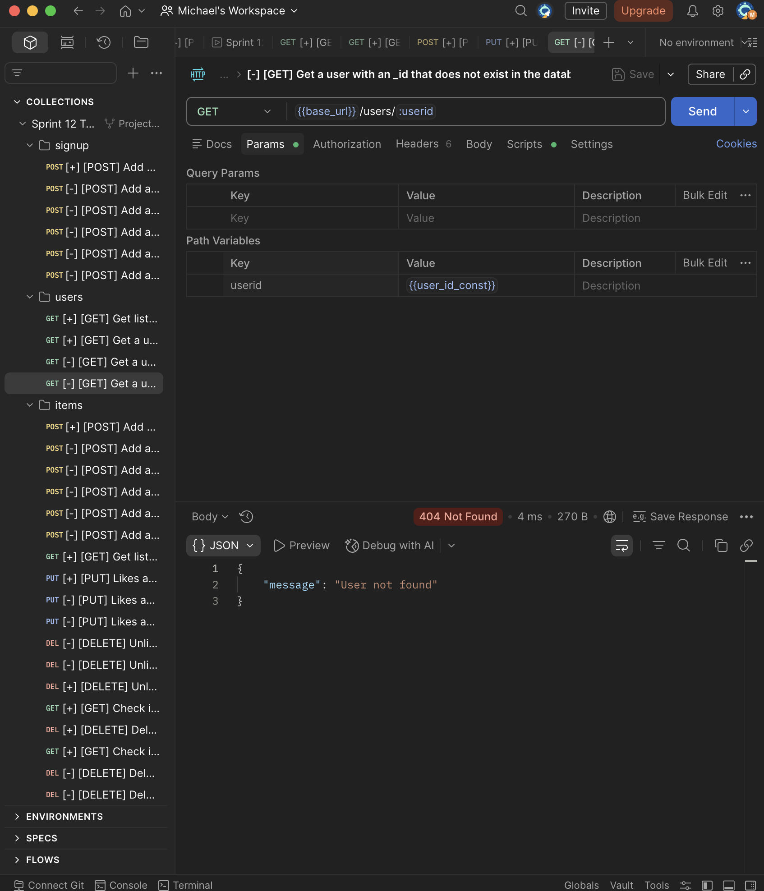

# WTWR (What to Wear?) Back End

## Project Description

This project is the back-end server for the WTWR application. It provides a REST API for user accounts and clothing items, stores data in MongoDB, authenticates users with JWTs, and returns structured JSON responses for both success and error cases.

The API supports user signup, signin, reading the current user profile, updating the current user profile, creating clothing items, listing clothing items, liking or unliking items, and deleting only the items owned by the authorized user.

## Functionality

- `POST /signup` creates a new user with a hashed password
- `POST /signin` validates credentials and returns a JWT
- `GET /users/me` returns the authorized user's profile
- `PATCH /users/me` updates the authorized user's `name` and `avatar`
- `GET /items` returns all clothing items
- `POST /items` creates a new clothing item for the authorized user
- `PUT /items/:itemId/likes` likes a clothing item
- `DELETE /items/:itemId/likes` removes a like from a clothing item
- `DELETE /items/:itemId` deletes a clothing item only if it belongs to the authorized user
- authorization middleware protects all private routes and leaves `POST /signup`, `POST /signin`, and `GET /items` public

## Technologies and Techniques Used

- Node.js for the server runtime
- Express.js for routing and HTTP request handling
- MongoDB for data storage
- Mongoose for schemas, models, validation, and database queries
- `validator` for URL and email validation
- `bcryptjs` for password hashing
- `jsonwebtoken` for token-based authorization
- `cors` for cross-origin request handling
- ESLint with `airbnb-base` and Prettier-compatible configuration for code quality
- Nodemon for hot reload during development
- Modular project structure with separated `routes`, `controllers`, `middlewares`, `models`, and `utils`
- Centralized error-code constants and request error handling with JSON responses

## Running the Project

- `npm run start` starts the server on `localhost:3001`
- `npm run dev` starts the server on `localhost:3001` with hot reload
- `npm run lint` runs ESLint

## Images / Screenshots

### Fetching Clothing Items

### Creating a Clothing Item

### Creating a User

### Liking an Item

### Error Response

